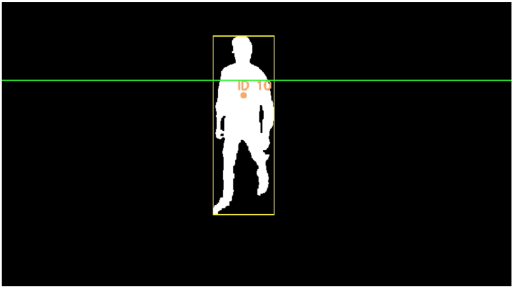
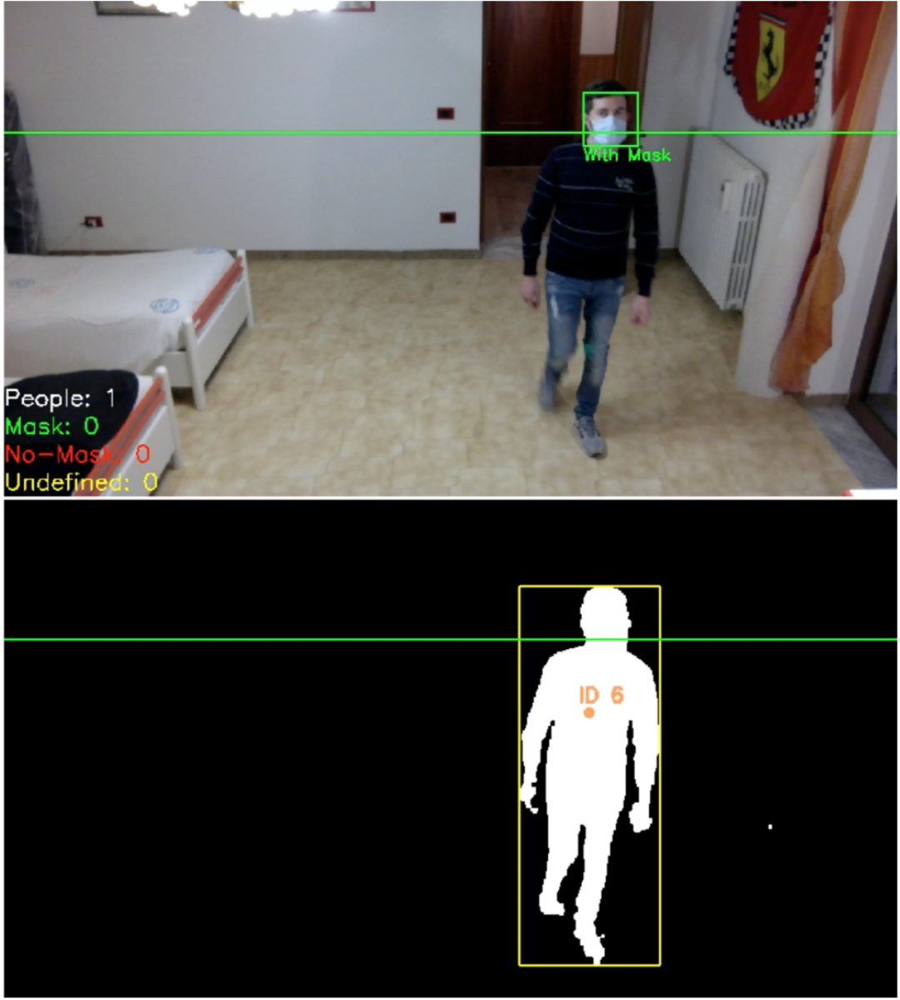
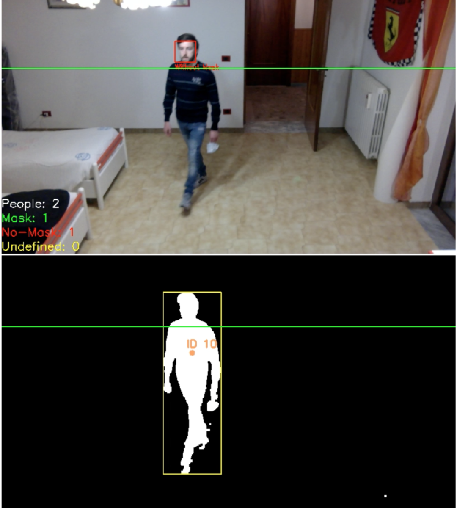

# Real-Time Face Mask Detection, Tracking and Counting using Haar Cascade Classifier and Motion Analysis

Final project for the course "Image Processing and Computer Vision" @Politecnico di Torino. 

*Main algorithms and techniques:* Haar Cascade Classifiers, BackgroundSubtractorMOG2.
 
*Evaluation metrics:* Accuracy, Precision, Recall, F1-score.
 
*Programming language and main libraries:* Python, OpenCV.

### Abstract

The objective of this work is to build a system that is able to monitor in real-time the use of face mask in places were it is considered mandatory. To do that, motion analysis technique will be used to find people inside the frame and then those regions will be analyzed using the Haar Cascade Classifier to detect masks. 
 Motion analysis allows to detect moving objects inside a frame by learning background according to history of frames and then performing a background subtraction on the new frame. This method will be used to identify the region of interest that will be analyzed by the classifier. To each ROI will also be assigned a centroid with an unique id to perform the count.
 Once identified the region, its content will be analyzed by two Haar Cascade Classifiers: the first will identify frontal faces, while the second will be used on faces extracted by the first to detect masks. People will be tracked during all the time they appear inside the recorded area and only when they disappear for a given number of frames, counters will be updated.

### Methods and algorithms
The main role of the system is to make a count of people with mask and people without mask that enter inside a place where a mask must be worn. To make an accurate count, it is not possible to simply track faces identified by Haar Classifier. Indeed, due to false negatives that it can produce while a person crosses the area, it can introduce errors in the tracking phase and this can lead to a wrong final count.
 Therefore, to avoid this problem, *motion analysis* technique has been considered to detect the full body and track it: each of the new bodies identified is associated to a new *centroid* with an unique id, while in the case of bodies whose centroid is near to a centroid found in the previous frame it is likely that it represents the same person that moved, so the id remains the same.
 Once identified a person, a crop of the original frame is extracted and analyzed by two *Haar Cascade Classifiers*. In particular, the first classifier will be used to identify the face, while the second will be used to detect the mask on the face extracted by the first. This method can help to reduce the computation needed at inference time since a frame with no people inside does not requires to be analyzed by the classifiers, and also to further reduce possible false positives as the first classifier acts only on a reduced area and the second only on faces.
 People will be tracked during all the time they appear inside the recorded area and only when they disappear for a given number of frames, counters will be updated. Counters will be updated according to results produced by the classifiers during all the tracking phase. Since they can produce some misclassifications, adopting a sort of *majority vote* to derive the final classification allows to reduce errors in the final count.

 For more details see [*IPCV-paper.pdf*](IPCV-paper.pdf). 

 

<figure>

<figcaption>Example of person detected in a frame</figcaption>

</figure>

  

<figure>

<figcaption>A frame representing a person with mask</figcaption>

</figure>

  

<figure>

<figcaption>A frame representing a person without mask</figcaption>

</figure>

  
